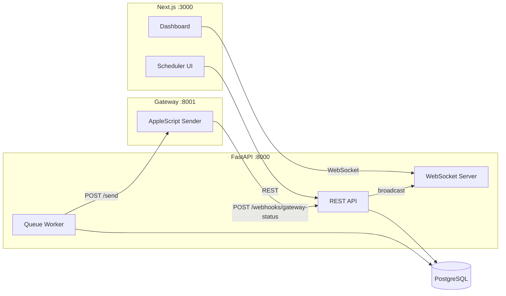

# iMessage Scheduler

A production-quality iMessage scheduling system. Schedule messages through a polished web UI, process them via a FIFO queue with configurable send rate, and deliver them through a macOS gateway.

---

## Reviewer Guide

If you're evaluating this project, here's where to start:

| What to review | Where to look |
|---|---|
| Queue processing logic | [`backend/api/app/queue/worker.py`](backend/api/app/queue/worker.py) -- FIFO claim, retry, stale recovery |
| Domain model & status transitions | [`backend/api/app/models/message.py`](backend/api/app/models/message.py) |
| REST API | [`backend/api/app/api/routes/`](backend/api/app/api/routes/) |
| Real-time updates | [`backend/api/app/api/ws.py`](backend/api/app/api/ws.py) + [`frontend/src/lib/use-websocket.ts`](frontend/src/lib/use-websocket.ts) |
| Gateway / AppleScript sender | [`backend/gateway/app/sender.py`](backend/gateway/app/sender.py) |
| Frontend UI | [`frontend/src/app/page.tsx`](frontend/src/app/page.tsx) + [`frontend/src/components/`](frontend/src/components/) |
| Tests | [`backend/api/tests/`](backend/api/tests/) -- 47 tests covering API, queue ordering, status transitions, webhooks |
| iMessage limitations | [Known Limitations](#known-limitations) section below |

---

## Architecture



**Data flow:**

1. User schedules a message via the web UI (REST `POST /api/messages`)
2. Backend persists it in PostgreSQL with status `QUEUED`
3. Queue worker polls for due messages, claims one atomically via `FOR UPDATE SKIP LOCKED`
4. Worker calls the gateway, which sends via AppleScript and reports status back via webhook
5. Backend broadcasts the status change to all connected WebSocket clients
6. UI updates in real-time without polling

---

## Project Structure

```
imessage_scheduler/
├── backend/
│   ├── api/                        # FastAPI backend
│   │   ├── app/
│   │   │   ├── api/routes/         # REST endpoints (messages, health, webhooks)
│   │   │   ├── db/                 # Database session + connection
│   │   │   ├── models/             # SQLAlchemy models + status transitions
│   │   │   ├── schemas/            # Pydantic request/response models
│   │   │   ├── queue/worker.py     # FIFO queue processor (core logic)
│   │   │   ├── services/           # Gateway HTTP client
│   │   │   ├── config.py           # Env-based settings
│   │   │   └── main.py             # App factory + lifespan
│   │   ├── alembic/                # Database migrations
│   │   └── tests/                  # 47 tests (API, queue, schemas, webhooks)
│   ├── gateway/                    # macOS iMessage gateway
│   │   ├── app/
│   │   │   ├── main.py             # Gateway HTTP API
│   │   │   ├── sender.py           # AppleScript execution + limitations docs
│   │   │   └── config.py
│   │   └── tests/                  # 9 tests (sender, API)
├── frontend/                       # Next.js frontend
│   └── src/
│       ├── app/                    # Pages: scheduler (/), dashboard (/dashboard)
│       ├── components/             # Form, message list, status badges, toast, modal
│       └── lib/                    # API client, WebSocket hook, formatters
├── packages/shared/                # Shared Zod schemas + TypeScript types
├── scripts/seed.py                 # Demo data seeder
├── .env.example                    # All configurable settings
└── README.md
```

---

## Tech Stack

| Layer | Technology | Why |
|-------|-----------|-----|
| Frontend | Next.js 16, TypeScript, Tailwind v4 | Modern React with App Router, type safety, utility CSS |
| Backend | FastAPI, SQLAlchemy 2.0 (async), Pydantic v2 | High-performance async Python, strong validation |
| Database | PostgreSQL 16 | `FOR UPDATE SKIP LOCKED` for safe queue claiming |
| Migrations | Alembic | Standard SQLAlchemy migration tool |
| Gateway | FastAPI + osascript | Lightweight service wrapping macOS AppleScript |
| Real-time | WebSocket | Push-based status updates to all clients |
| Logging | structlog | Structured, queryable log output |
| Tests | pytest + httpx | Async test client with full API coverage |

---

## Setup & Running

### Prerequisites

- **macOS** (for the gateway and Messages.app)
- **PostgreSQL** 16 (local install, Postgres.app, or cloud instance)
- Node.js 20+, Python 3.12+
- Messages.app signed in to an iMessage account

### Quick Start

**One venv, one command (API + Gateway):**

```bash
# 1. Configure environment
cp .env.example .env
# Edit .env if needed: DATABASE_URL (default localhost:5432), GATEWAY_URL (default localhost:8001)

# 2. Create the database (PostgreSQL must be running)
createdb imessage_scheduler   # or use your Postgres tool

# 3. Backend: single venv at backend/, runs API (8002) + Gateway (8001)
cd backend
./start.sh
# First run creates .venv and installs deps. In another terminal, run migrations once:
#   cd backend && source .venv/bin/activate && cd api && alembic upgrade head

# 4. Frontend (another terminal)
cd frontend
npm install
npm run dev
```

Open **http://localhost:3000** (or 3001) for the scheduler, **http://localhost:3000/dashboard** for the dashboard, and **http://localhost:8002/docs** for the API docs.

---

## How Queue Processing Works

The queue worker is the core of the system. It runs as an asyncio background task inside the API process.

### Claim Algorithm

```
every {QUEUE_POLL_INTERVAL_SECONDS}:
  1. Check rate limit: if last send was < (3600 / SEND_RATE_PER_HOUR) seconds ago, skip
  2. Query: SELECT * FROM messages
            WHERE status = 'QUEUED' AND scheduled_at <= now()
            ORDER BY scheduled_at ASC, created_at ASC
            LIMIT 1
            FOR UPDATE SKIP LOCKED
  3. If found: atomically set status = ACCEPTED, increment attempts, commit
  4. Call gateway POST /send with message details
  5. On success: persist gateway_message_id, wait for webhook callback
  6. On failure: retry with exponential backoff, or mark FAILED after max attempts
```

### Key Reliability Features

- **Atomic claiming** via `FOR UPDATE SKIP LOCKED` prevents double-processing even with concurrent workers
- **Stale claim recovery** on startup: messages stuck in ACCEPTED for >5 minutes are reverted to QUEUED
- **Rate limit persistence**: last send time is loaded from the database on restart
- **Bounded retries** with exponential backoff (5min, 15min, 45min) and a configurable max (default: 3)
- **Explicit status transition rules** enforced at the domain model level
- **Structured logging** at every lifecycle point: claimed, gateway accepted, retry scheduled, permanently failed

---

## Status Lifecycle

```
                    ┌──────────┐
             ┌─────│  QUEUED   │─────┐
             │     └────┬─────┘     │
             │          │           │
         (cancel)    (claim)     (retry)
             │          │           │
             ▼          ▼           │
      ┌───────────┐ ┌──────────┐   │
      │ CANCELLED │ │ ACCEPTED │───┘
      └───────────┘ └────┬─────┘
                         │
                    (gateway callback)
                    ┌────┴─────┐
                    │          │
                    ▼          ▼
             ┌──────────┐ ┌──────────┐
             │   SENT   │ │  FAILED  │
             └────┬─────┘ └──────────┘
                  │
             (if detectable)
                  ▼
             ┌──────────┐
             │ DELIVERED │
             └──────────┘
```

- **QUEUED**: Message is waiting for its scheduled time
- **ACCEPTED**: Worker has claimed the message and is sending it
- **SENT**: Gateway confirmed the message was handed to Messages.app
- **DELIVERED**: Delivery confirmed (not currently detectable -- see limitations)
- **FAILED**: All retry attempts exhausted, or unrecoverable error
- **CANCELLED**: User cancelled before sending

---

## Configuration

All settings are via environment variables (see `.env.example`):

| Variable | Default | Description |
|----------|---------|-------------|
| `SEND_RATE_PER_HOUR` | `1` | Maximum messages sent per hour |
| `QUEUE_POLL_INTERVAL_SECONDS` | `30` | How often the worker checks for due messages |
| `MAX_RETRY_ATTEMPTS` | `3` | Retries before permanently failing a message |
| `GATEWAY_URL` | `http://localhost:8001` | URL of the macOS gateway |
| `DRY_RUN` | `false` | Gateway: simulate sends without AppleScript |
| `LOG_LEVEL` | `INFO` | Logging verbosity |

To change the send rate, set `SEND_RATE_PER_HOUR=10` for 10 messages/hour (one every 6 minutes).

---

## Testing

```bash
# API tests (47 tests)
cd backend/api && source .venv/bin/activate
pip install -r requirements-dev.txt
pytest tests/ -v

# Gateway tests (9 tests)
cd backend/gateway && source .venv/bin/activate
pip install -r requirements-dev.txt
pytest tests/ -v
```

Tests use SQLite (in-memory) and mocked subprocess calls. No external services required.

**Test coverage includes:**
- CRUD operations and validation (phone normalization, timezone validation)
- FIFO queue ordering (scheduled_at tiebreak by created_at)
- Claim eligibility (future messages excluded, non-QUEUED skipped)
- Status transition enforcement (all valid + invalid transitions)
- Webhook idempotency (duplicate webhook is rejected)
- Retry logic and terminal failure states
- Gateway AppleScript execution (success, failure, timeout, escaping)

---

## API Reference

| Method | Endpoint | Description |
|--------|----------|-------------|
| `POST` | `/api/messages` | Schedule a new message |
| `GET` | `/api/messages` | List messages (filter by `?status=QUEUED`) |
| `GET` | `/api/messages/{id}` | Get a single message |
| `PATCH` | `/api/messages/{id}` | Edit a queued message |
| `DELETE` | `/api/messages/{id}` | Cancel a queued message |
| `POST` | `/api/webhooks/gateway-status` | Gateway status callback |
| `GET` | `/api/stats` | Aggregate counts by status |
| `GET` | `/api/health` | Health check (DB connectivity) |
| `GET` | `/api/readiness` | Extended check (DB + gateway + WS clients) |
| `WS` | `/ws/updates` | Real-time status event stream |

Full OpenAPI docs at **http://localhost:8002/docs** when running.

---

## Architecture Decisions

**PostgreSQL as the queue backend.** Instead of adding Redis or Celery, the queue uses PostgreSQL's `FOR UPDATE SKIP LOCKED` for atomic claim operations. This is simpler to operate (one fewer service), sufficient for single-gateway throughput, and provides the same ACID guarantees as the rest of the data layer. A dedicated queue (SQS, Redis Streams) would make sense at scale.

**Gateway as a separate HTTP service.** Rather than embedding AppleScript calls in the backend, the gateway is a standalone service so the backend stays portable and the gateway can be swapped for a different sending mechanism (Twilio, carrier API) without touching backend code.

**WebSocket for real-time updates.** Status changes are pushed to all connected clients instantly via WebSocket. This avoids polling and keeps the UI feeling live. The connection auto-reconnects on disconnect.

**Single async worker in-process.** The queue worker runs as an asyncio task inside the API process. For a single-gateway setup this is simpler than a separate worker process. The code is structured so extracting it into a standalone process is straightforward if needed.

**Stale claim recovery on startup.** If the process crashes while a message is in ACCEPTED status, it would be stuck forever. On startup, the worker recovers any messages that have been in ACCEPTED for more than 5 minutes by reverting them to QUEUED. This is a simple, conservative approach that avoids the need for distributed locking.

---

## Known Limitations

### iMessage Delivery Detection

This is the most important limitation. macOS AppleScript can only *send* messages through Messages.app. It **cannot** reliably detect:

- Whether the message was delivered to the recipient's device
- Whether the recipient read the message

When osascript exits successfully, Messages.app has accepted the send request. We report this as `SENT`. The actual delivery to Apple's servers and the recipient's device happens asynchronously inside Messages.app and is not observable via AppleScript.

The `DELIVERED` status exists in the data model and UI, but the current gateway cannot populate it. Reading the Messages SQLite database (`~/Library/Messages/chat.db`) is possible but fragile: it requires Full Disk Access, the schema is undocumented, and it changes between macOS versions. The architecture supports adding a delivery poller in the future.

### Other Limitations

- **No authentication.** The API is open. Production would need JWT or API key auth.
- **Single worker instance.** Running multiple API instances requires coordinating workers.
- **No encryption at rest.** Message bodies are stored as plaintext.
- **Phone validation is basic.** E.164 format only; production should use libphonenumber.
- **No message deduplication.** Identical messages can be scheduled multiple times.

---

## If I Had More Time

1. **Authentication and multi-tenancy** -- JWT auth with per-user message isolation
2. **Delivery status polling** -- Read `chat.db` for actual delivery confirmation
3. **Distributed worker** -- External job queue (Redis Streams or SQS) for horizontal scaling
4. **E2E tests** -- Playwright tests for the full scheduling flow
5. **Prometheus metrics** -- Queue depth, send latency, failure rate dashboards
6. **Message templates** -- Save and reuse common messages
7. **Batch scheduling** -- Send the same message to multiple recipients
8. **CI/CD pipeline** -- GitHub Actions for lint, test, build on every push
9. **Graceful shutdown** -- Ensure in-flight messages complete before process exit
10. **Audit trail** -- Log every status change with timestamps for compliance
11. **Rate limit UI** -- Dashboard control for changing send rate without restarting
12. **Notification on failure** -- Alert the user via email/push when a message permanently fails
13. **GitHub Actions + basic deployment** -- Set up CI (lint, test, build) and deploy a basic version of the app for this assessment
